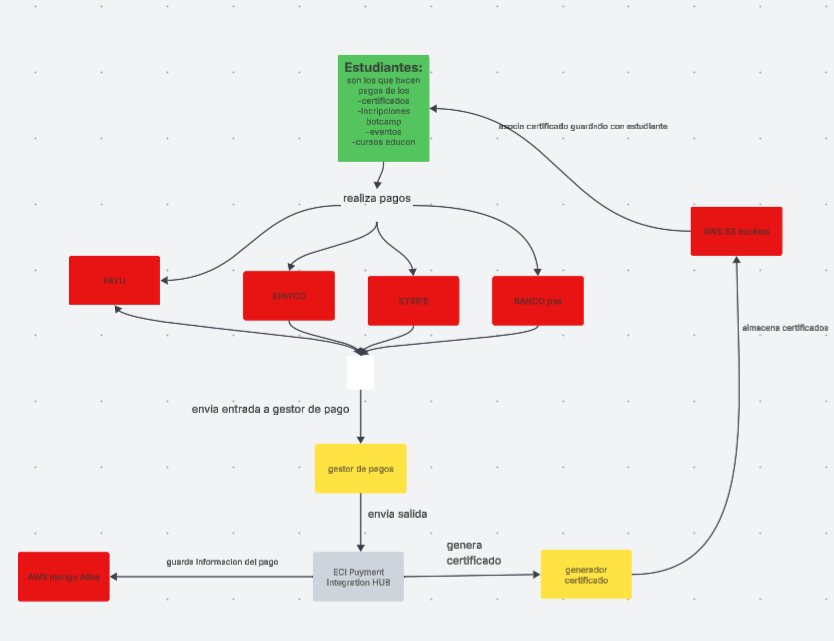
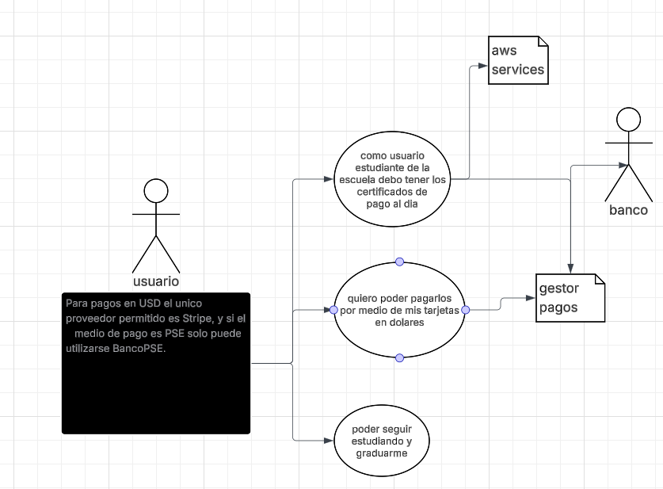
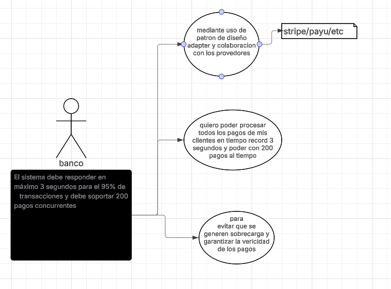

# PUNTO 1

Diagrama de contexto de eciPaymentsHUB

# Punto 2

los patrones de diseño elejidos son 

## Adapter
al tener tantos provedores de pagos debe existir un metodo para manejar la informacion y unificarlas para asi garantizar que los datos puedan ser procesados de manera correcta segun la entrada esperada

## Abstract Factory 
al existir tantos tipos de certificado , que aunque son parecidos , son realmente diferentes debe exsitir un metodo de devolver al usuario de acuerdo a sus requerimientos.
para esto usaremos interfaces para establecer contratos y que los certificados cumplan con requisitos.

# Punto 3

Identifique 5 requerimientos del sistema y clasifíquelos en funcionales (3) y
no funcionales (2). Garantice que al menos un requerimiento funcional
seleccionado utilice uno o los dos patrones identificados. (Añadirlo al
README.md)

## los requerimientos funcionales
1. se requiere que la informacion de pago se guarde en los servicios de aws
2. Para pagos en USD el unico proveedor permitido es Stripe, y si el
   medio de pago es PSE solo puede utilizarse BancoPSE.
3. El sistema debe responder en máximo 3 segundos para el 95% de
   transacciones y debe soportar 200 pagos concurrentes
4. se quiere poder ver el historial de pagos por usuario para que ellos puedan trackear sus transacciones

## requerimientos no funcionales

1. los requrimientos visuales como el color de la pagina web
2.  Debe ser responsive

## Punto 4

